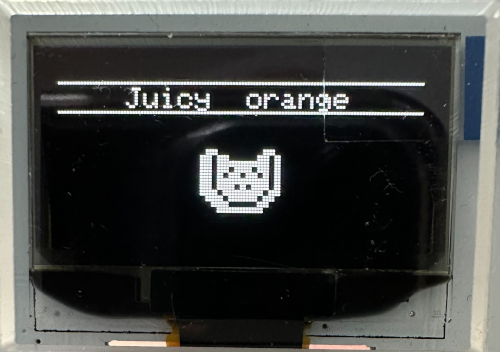
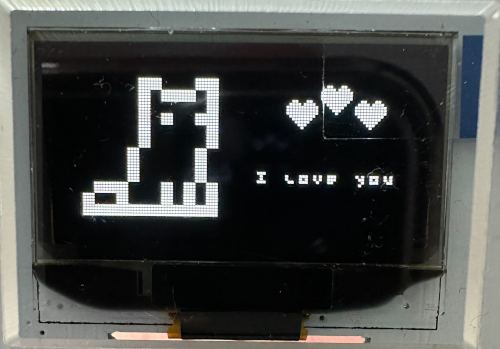

# Presentation

**A quiet virtual pet - Feed, cuddle, clean and educate your own unique cat**

2 mini games, 7 food types, friends visits and presents, one button action, no sound, no death.

Runs on Arduino Leonardo R3. Available for Arduboy and M5 Stick C Plus.

> **Game type**: Virtual Pet
>
> **Game Style**: Idle Game
>
> **Players**: One 
>
> **Age range**: 7 to 77 years old

TiMiNoo ("Tee Me Noo") is a virtual cat providing minimal distraction, fully office-compatible, single button action, no sound, no death. The cat is different on each run, his characteristics are randomly picked at startup. It has been created with busy people in mind: The gameplay is simple enough for this game to be enjoyed in a work environment.

TiMiNoo is a feature-rich virtual cat, a companion for busy days: Cuddle, Feed, Educate, Wash and Entertain your very own furry companion. Tamagotchi lovers could compare it to a Nano.

# Features
## Single button gameplay
Wanting a gameplay as simple as can be, a single button solution seemed very appealing. Click once or click repeatedly depending on the action, that's it.
## No sound
I love having a virtual pet on my desk at work, but I also need to preserve my workflow from distractions. No beeping sounds is what I need.
## 2 mini games: Catsino Deluxe and Catwash Station
- *Catsino Deluxe*: Go to the casino with your TiMiNoo and do your best to win some yummy food to bring home. Beware of the ghost though!
- *Catwash Station*: When the fur of your TiMiNoo gets dirty, it's time for a proper toilet. Scrub scrub!
## 7 food items
Feed your TiMiNoo whenever he gets hungry. TiMiNoo doesn't die if you don't feed him, but he will give you that big eyes stare. Feed him a variety of food including:

| Icon | Item |
| ---- | ---- |
|  | Grape |
|  | Strawberry |
|  | Apple |
|  | Orange |
|  | Milk |
|  | Coco cake (bonus item) |
|  | Matcha tea (bonus item) |
## Lessons with Professor Koko
Your TiMiNoo wants to become a cultured cat. Call Professor Koko Le Snail, a wise teacher that will share his best knowledge with him.
## Cuddle time
TiMiNoo craves attention and love, make sure to give him plenty.
## Visits from a friend
Occasionally, when TiMiNoo gets hungry, his friend comes home and offer either a cup of hot Matcha tea or a slice of home made Coco cake.

## Gain points
Earn points every time you take action and increase your score.
### Feed

| Food type | Bonus |
| --------- | ----- |
| Strawberry | +30 points |
| Grape, orange, apple | +20 points |
| Milk | +10 points|

### Play At The Catsino Deluxe

| Item | Bonus |
| ---- | ----- |
| BAR | +500 points |
| Strawberry | +300 points |
| Grape, orange, apple | +200 points |
| Milk | +100 points |

### Cuddle
- Give a big kiss and a hug to your cat: +50 points
### Educate
- Get some good wisdom from Koko Le Snail: +100 points
### Wash your TiMiNoo at the Catwash Station
- Keep your cat clean: +200 points
### Visit from a friend
- Receive a visit from your friend: +10000 points
### Beware of the ghost !
- Ghost encounter: -666 points
# How to play
## Starting the game
Plug your TiMiNoo to a 5V Micro USB power supply to start a new game. There is no save feature and no experience, but scoring is available.

Every run is a fresh beginning with new statistics:

- **Appetite**: How often your TiMiNoo will ask for food,
- **Hygiene**: How quickly your TiMiNoo gets dirty,
- **Morale**: How happy your TiMiNoo feels,
- **Education**: How well trained your TiMiNoo is,
- **Entertainment**: How often your TiMiNoo will want to play.

TiMiNoo cannot die.
## Understand what your TiMiNoo wants
### Home screen
TiMiNoo looks straight at you, waving his tail. He is happy, simply enjoying the moment.

TiMiNoo will express his joy right after you take action on his needs:

### TiMiNoo wants to play
TiMiNoo looks at a gamepad icon. Press the button once to play Catsino Deluxe.

### TiMiNoo wants to go to school
TiMiNoo looks at a book icon. Press the button once to call Professor Koko Le Snail, a wise and knowledgeable teacher.

### TiMiNoo is hungry
TiMiNoo looks at a pizza slice icon. Press the button to feed your TiMiNoo with the food stashed in the pantry.

### TiMiNoo wants to cuddle with you
TiMiNoo looks at a half-empty heart icon. Press the button to kiss your furry cuttie.

### TiMiNoo needs a bath
TiMiNoo looks at a bubble icon. Press the button in order to scrub all that dust off his fur.

## How to play Catsino Deluxe
Earn random items and points at the Catsino!

| Item | Bonus |
| ---- | ----- |
| BAR | +500 points |
| Strawberry | +300 points |
| Grape, orange, apple | +200 points |
| Milk | +100 points |

1. TiMiNoo wants to play. *Press the button once*.

2. Items are moving across the screen. *Press the button once*.

3. Time to loot!

## How to get a lesson with Professor Koko Le Snail
1. TiMiNoo want to learn. *Press the button once*.

2. Professor Koko Le Snail arrives.

3. Professor Koko Le Snail introduces himself.

4. Professor Koko Le Snail shares his wisdom.

## How to feed TiMiNoo
 Food type | Bonus |
| --------- | ----- |
| Strawberry | +30 points |
| Grape, orange, apple | +20 points |
| Milk | +10 points|

1. TiMiNoo is hungry. *Press the button once*.

2. A random food item is removed from the pantry.

3. TiMiNoo is having a feast!

## How to cuddle with TiMiNoo
1. TiMiNoo calls for attention, he wants you to pet him. *Press the button once*.

2. TiMiNoo shares the love with you.

## How to play Catwash Station
1. TiMiNoo is dirty and needs a good wash. *Press the button once*.

2. Get some soap and scrub! *Press the button repeatedly until bubbles fill the whole screen*.

3. TiMiNoo is all clean now!

# Build your own

## Items
- 1x Arduino Leonardo R3
- 1x Button
- 1x 128*64 OLED screen
- 1x 10k Ohm resistor
- 1x breadboard or prototyping board
- 1x Acrylic enclosure for UNO / Leonardo
- Enough jumper cables to assemble the circuitry
## Assembly
### Drawing

### Photos

### Screen pinout
- DC -> D9
- CS -> D10
- MOSI -> D11
- CLOCK -> D13
- RES -> RST
- VCC -> 5V
- GND -> GND
### Button
- GND -> GND
- VCC -> 3V
- SIG -> D2
## Installation instructions
Use [Arduino IDE](https://support.arduino.cc/hc/en-us/articles/360019833020-Download-and-install-Arduino-IDE) to upload `timinoo.ino` to your Arduino Leonardo.
Make sure you use a Micro USB cable that supports data transfer, as some cables do not have data lines wired and only provide charging capability.
