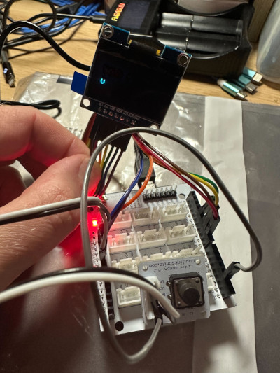

# TiMiNoo
Cute 1 bit VPet for Arduino

# Hardware requirements
- 1x Arduino Leonardo R3
- 1x Button
- 1x 128*64 OLED screen
- Enough jumper cables to assemble the circuitry

As of now, the TiMiNoo is a messy prototype. More details will be provided as the project progresses.

