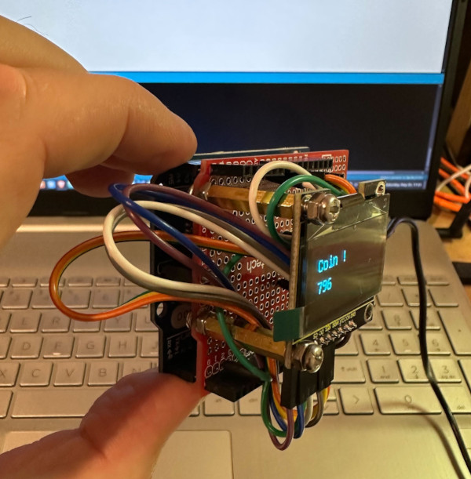

# TiMiNoo
Cute 1 bit VPet for Arduino

## Hardware requirements
- 1x Arduino Leonardo R3
- 1x Button
- 1x 128*64 OLED screen
- 1x 10k Ohm resistor
- Enough jumper cables to assemble the circuitry

As of now, the TiMiNoo is a messy prototype. More details will be provided as the project progresses.

## Commercial status
TiMiNoo is an open source project that is not meant to be sold. Please note the cat sprites are under a [Creative Commons Attribution-NonCommercial 4.0 International CC BY-NC 4.0](https://creativecommons.org/licenses/by-nc/4.0/) license that explicitly prohibits commercial use. I'm 100% OK with this.
