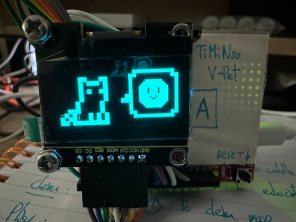

# TiMiNoo
Cute 1 bit VPet for Arduino - Feed, cuddle, clean and educate your own unique cat.

## Current version: 1.2.1
## WIP version: -

## Presentation

TiMiNoo is an Open Source virtual pet for Arduino Leonardo R3. It's a game in which you take care of a cute cat: you feed it, clean it, train it and cuddle it.
The cat is different on each run, its characteritics are randomly picked at startup.

TiMiNoo has been created with busy people in mind: only one button, fast action, no sound. The gameplay is very simple and fluid on purpose, as this game is meant to be playable in an office environment with minimal disturbance.

TiMiNoo is about enjoying a simple yet feature-rich virtual cat, a companion for busy days.

Tamagotchi lovers could compare it to a Nano.

## Features
### Single button gameplay
I love having a virtual pet on my desk at work, but I also need to preserve my workflow from distractions.
A single button gameplay is perfect for that.
### 2 mini games
#### Catsino
Go to the casino with your TiMiNoo and do your best to win some yummy food to bring home.
Press the button once to randomly pick a food item. Beware of the ghost though !
#### Clean The Cat
When the fur of TiMiNoo gets dirty, it's time for a proper toilet. Scrub scrub !
Repeatedly press the button to get a squicky clean kitty.
### 7 food items
Your TiMiNoo will get hungry as time goes on. Feed it a variety of food including:
- Grape
- Strawberry
- Apple
- Orange
- Milk
- Coco cake (bonus item)
- Matcha tea (bonus item)
### Educate your cat with Professor Koko
Your TiMiNoo will want to learn new things. Call Professor Koko Le Snail, a wise teacher that will share is best knowledge with your cuttie.
### Cuddle
TiMiNoo craves attention and love, make sure to give it plenty.
### Random visits from a friend
Sometimes, when the cat gets hungry, its friend Cindy will come and offer either a nice Matcha tea or a home made Coco cake.

## How to play
### Starting the game
Plug your TiMiNoo to a 5V Micro USB charger, a new game will start.
There is no save feature, no scoring, no experience. Every run is a fresh beginning with new statistics.
TiMiNoo cannot die.
### Understand what your TiMiNoo wants
#### Home screen
TiMiNoo looks straight at you, waving its tail.
It's happy, simply enjoying the moment.
#### TiMiNoo wants to play
The cat will look at a gamepad icon.
Press the button once to play the integrated game: Casino.
Food items will appear on the screen, press the button once to try your luck and see what you catch.
That game is how TiMiNoo gets new food into its pantry.
#### TiMiNoo wants to go to school
The cat will look at a book icon.
Press the button once to call Professor Koko Le Snail, a wise and knowledgeable teacher. He will happily share his best quotes with your TiMiNoo.
#### TiMiNoo is hungry
The cat will look at a pizza slice icon.
Press the button to feed your TiMiNoo with the food stashed in the pantry. 
#### TiMiNoo wants to cuddle with you
The cat will look at a half-empty heart icon.
Press the button to kiss your furry cuttie.
#### TiMiNoo needs a bath
The cat will look at a bubble icon.
Press the button in order to scrub all that dust off its fur.
## How to build your own
### Hardware requirements
- 1x Arduino Leonardo R3
- 1x Button
- 1x 128*64 OLED screen
- 1x 10k Ohm resistor
- 1x breadboard or prototyping board
- Enough jumper cables to assemble the circuitry

## Commercial status
TiMiNoo is an open source project that is not meant to be sold. Please note the cat sprites are under a [Creative Commons Attribution-NonCommercial 4.0 International CC BY-NC 4.0](https://creativecommons.org/licenses/by-nc/4.0/) license that explicitly prohibits commercial use. I'm 100% OK with this.
